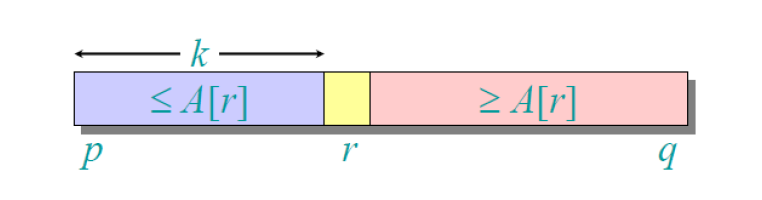
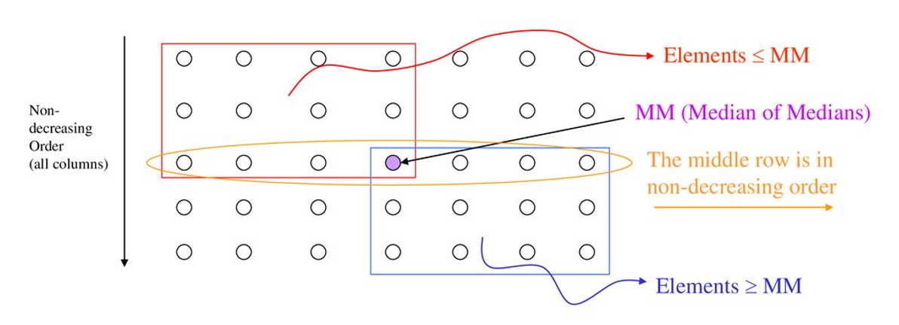
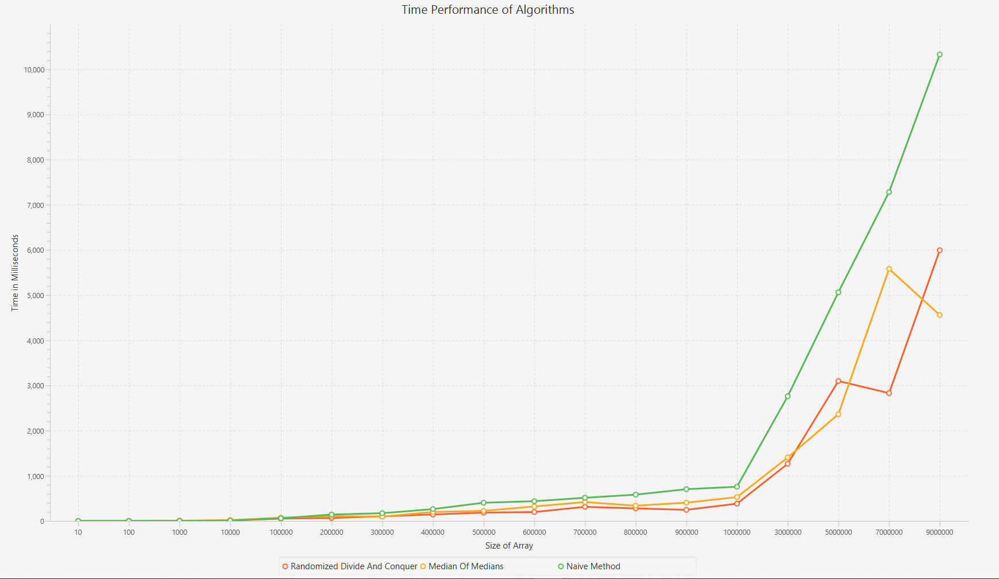

# Selection Algorithm Analysis
Java program that simulates different selection algorithms, analyzing their performance and running times in computing median position. Uses JavaFX to visualize the running times for a more vivid comparison.
Analyzes array size ranging from 10 to 10^7.

## What Is Selection
Selecting the ith smallest of n elements (the element with rank i)
- i=1: minimum
- i=n: maximum
- i=[(n+1)/2]: median

## Methods
- Randomized divide-and-conquer
- Median-of-Medians
- Quicksort (naive approach for comparison purposes)

## Randomized divide-and-conquer
- Partition around a random element
- Running time is independent of the input order
- No assumptions need to be made about the input distribution
- No specific input elicits the worst-case behavior
- Worst-case determined only by the output of the random number generator

## Median-of-Medians
- Divide n elements into groups of 5
- Find the median of each 5-element group trivially
- Recursively select the median x of the [n / 5] group medians to be the pivot
- Partition around the pivot x, let k = rank(x)
- if i==k return x
- if i<k --> recursively select the ith smallest element in the lower part
- if i>k --> recursively select the (i-k)th smallest element in the upper part

## Quicksort
- Sorting the array using quicksort O(nlog(n))
- Selecting ith element

## Results

## What I Learned
- Performance of each algorithm in selection
- Randomization contributing to better performance
- How less efficient a naive approach would be
- They produce a linear expected time best case
- Still worst-case could reach O(n^2)

